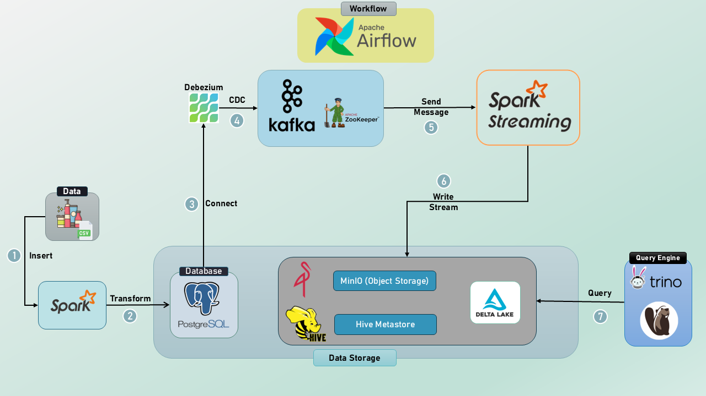
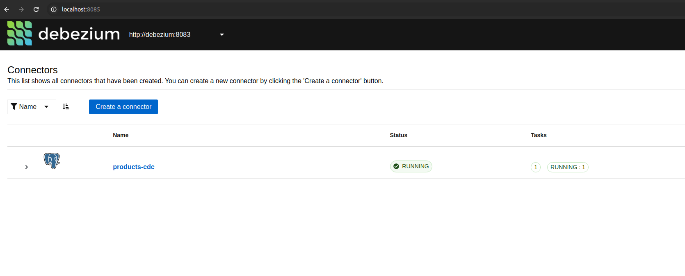
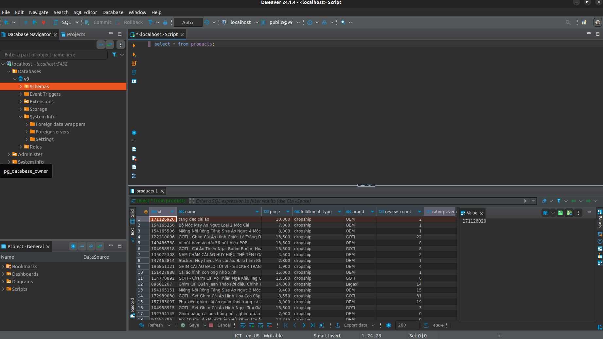

# DATA STREAM PROCESSING

## Overview

* Persist data to PostgreSQL.
* Monitor changes to data using the Debezium Connector.
* Stream data from a Kafka topic using PySpark (Spark Streaming).
* Convert the streaming data to Delta Lake format.
* Write the Delta Lake data to MinIO (AWS Object Storage).
* Query the data with Trino.
* Display the results in DBeaver.

## System Architecture

<p align = "center">
    
</p>

## Prequisites 

Before runing this script, ensure you have the following installed.\
**Note**:  The project was setup on Ubuntu 22.04 OS.

* Ubuntu 22.04 (prefered, but you can use Ubuntu 20.04)
* Python 3.10
* Apache Spark (installed locally)
* Apache Airflow
* Confluent Containers (Zookeeper, Kafka, Schema Registry, Connect, Control Center)
* Docker
* Minio
* Trino, DBeaver CE
* Delta Lake
* Debezium, Debezium UI

## Start

1. **Clone the repository**
```bash
$ git clone https://github.com/VuBacktracking/stream-data-processing.git
$ cd stream-data-processing
```

2. **Start our data streaming infrastructure**
```bash
$ sudo service docker start
$ docker compose -f storage-docker-compose.yaml -f stream-docker-compose.yaml up -d
```

3. **Setup environment**
```bash
$ python3 -m venv .venv
$ pip install -r requirements.txt
```

Create `.env` file and paste your MINIO keys, SPARK_HOME in it.
```ini
# MinIO
- MINIO_ACCESS_KEY='minio_access_key'
- MINIO_SECRET_KEY='minio_secret_key'
- MINIO_ENDPOINT='http://localhost:9000'
- BUCKET_NAME='datalake'

# Postgres SQL
- POSTGRES_DB='v9'
- POSTGRES_USER='v9'
- POSTGRES_PASSWORD='v9'

# Spark
- SPARK_HOME=""
```

4. **Services**

* Postgres is accessible on the default port 5432.
* Debezium UI: http://localhost:8080.
* Kafka Control Center: http://localhost:9021.
* Trino: http://localhost:8085.
* MinIO: http://localhost:9001.

## How to use?

- **Step 1. Start Debezium Connection**
```bash
cd debezium
bash run-cdc.sh register_connector conf/products-cdc-config.json
```

You should see the connection is running like the image below in the port http://localhost:8085.

<p align = "center">
    
</p>

- **Step 2. Create table and insert data into Database**

```bash
python3 database-operations/create_table.py
python3 database-operations/insert_table.py
```

In the PostgreSQL connection, you should see the database `v9` and the table `products` like the image below.

<p align = "center">
    
</p>